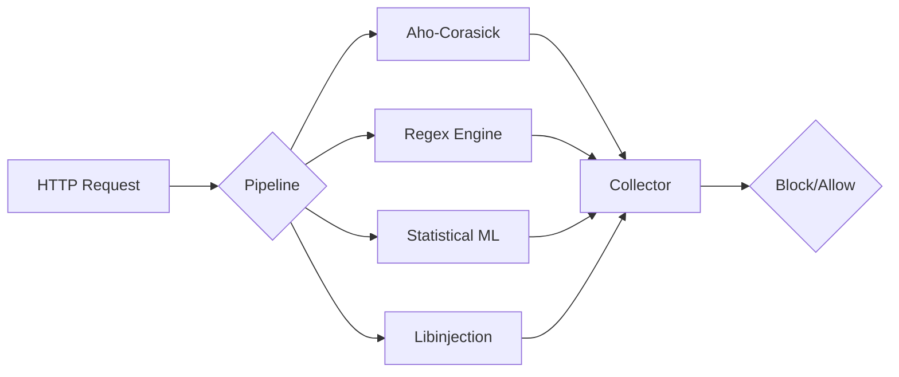

# Go-WAF Architecture Deep-Dive

Go-WAF is designed around a **Parallel Analysis Pipeline** to minimize request latency while maximizing security depth.

## 1. The Parallel Pipeline
Unlike traditional WAFs that run rules sequentially, Go-WAF executes multiple analysis engines simultaneously across a worker pool.

## 2. Security Engines

### CRSLang Engine
A modern implementation of the OWASP Core Rule Set logic using YAML. It provides stateful inspection (using Redis) and transactional variable management.

### Statistical ML Engine (ML-Lite)
Detects zero-day threats using high-dimensional fingerprinting:
- **KL-Divergence**: Measures structural deviation from normal traffic.
- **N-gram Anomaly**: Detects obfuscated payloads (Log4j, shellcode).
- **Entropy Analysis**: Identifies encrypted/compressed payloads.

### DLP Engine (Data Loss Prevention)
A post-analysis engine that inspects response bodies. It uses the Luhn algorithm for Credit Cards and entropy-based scanners for AWS/Stripe/Azure secrets.

### gRPC/HTTP2 Parser
Deep inspection for binary protocols. It extracts Protobuf fields and maps them to the WAF's ARGS collection for standard rule enforcement.

## 3. Distributed State (Redis)
Go-WAF uses Redis to maintain global state across a cluster:
- **Rate Limiting**: Sliding window counters.
- **IP Reputation**: Dynamic blocking of repeat offenders.
- **CRS Collections**: Persisting `IP` and `USER` collections for complex multi-request correlation.
